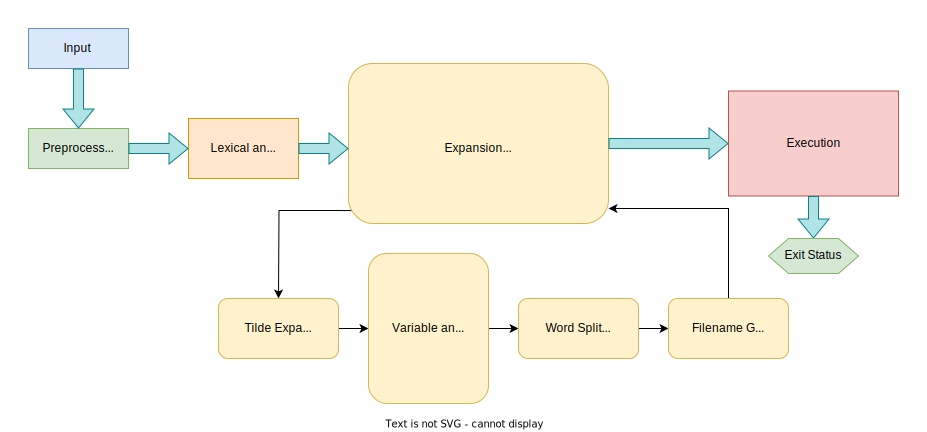

# Minishell [](https://github.com/JaeSeoKim/badge42)

## Description

Minishell is a lightweight implementation of POSIX shell designed to provide a minimalistic command-line interface for interacting with an operating system.

Minishell will support the following features:

1. Display a user-friendly prompt when waiting for a new command, providing an intuitive user experience.
2. Maintain a working command history, allowing users to easily navigate and recall previously executed commands.
3. Search and launch the correct executable based on `PATH` variable or relative/absolute paths, offering a smooth command execution process.
4. Forgo support for unclosed quotes and special characters such as `\` (backlash) and `;` (semicolon), ensuring a cleaner and less error-prone user experience.
5. Support single quotes `'` , preventing the shell from interpreting characters within the quoted sequence, allowing users to work with literal strings.
6. Support double quotes `"` , preventing the shell from interpreting characters within the quoted sequence, except for the `$` (dollar sign) for variable expansion.
7. Provide support for I/O redirections and here documents (`<` , `>` , `>>` , `<<` ), enabling users to redirect input and output between commands and files.
8. Handle environment variables, allowing users to set, modify, and retrieve variables as needed.
9. Manage `ctrl-C` , `ctrl-D` and `ctrl-\` signals, ensuring proper behavior similar to that of `bash`.
10. Support special variables, such as `$?`, for context-based command behavior.
11. Support compound commands with a subshell execution `()` .
12. Support command lists with `&&` (AND_IF) and `||` (OR_IF) operators.
13. Wildcard `*` support for current working directory.
14. Implement built-in commands, including `echo`, `cd`, `pwd`, `export`, `unset`, `env` and `exit`, providing essential shell functionality out-of-the-box.

## Installation

If you don't have `gcc` or GNU `make` do these commands:
```bash
sudo apt update
sudo apt install build-essential
```
To install `readline` use this command:
```bash
make configure
```
To install `minishell` just run `make` in the root of the cloned repository.

## Architecture

Minishell's architecture is designed to provide a modular and efficient command-line interface. The project is structured into six distinct modules, each responsible for a specific aspect of Minishell's functionality. These modules work together cohesively to deliver seamless user experience. The following sections outline each module's purpose and functionality.



### Module Descriptions

- 	`Input` module reads the user input and displays a prompt when waiting for a new command. This module uses the `readline` library, which provides line editing and command history capabilities. Custom signals required for the project are part of this module as well.
-	`Lexical Analysis` module generates a list of tokens from the given input to be later used to break it down into an abstract syntax tree from defined `Context-Free Grammar`.
-	`Parser` interprets the string of tokens and builds an AST according to the Context-Free Grammar.
-	`Expansion` module is responsible for shell expansions. Our project supports all bash-performed expansions, although on a more limited scale.
-	`Execution` unit executes the commands in the processed AST. This module handles built-ins, process creation, and process management. Additionally, it handles input/output redirection and pipelines, command lists, and subshell execution.
-	`Exit Status` unit collects the exit status after execution, storing it in a special variable `?`. It also cleans up the memory that is no longer in use.

## Context-Free Grammar

We will define our grammar in EBNF (Extended Backus-Naur form).
Symbols come in two forms:
-	`terminal`-  letter from the grammar alphabet. In this syntactic grammar, the terminals are individual lexeme-tokens from the scanner like `|` or `cat`. We name terminals with all uppercase symbols, with or without underscores. For example: `PIPE_OP` or `WORD`.
-	`non-terminal` - named reference to another rule in the grammar. It means “play that rule and insert whatever it produces here”. We define non-terminals with all lowercase symbols, with or without underscores.
- We define the end of the rule with the symbol `;`
- We allow a series of productions separated by a `|` (pipe).
- We use the postfix operator * to allow the previous symbol or group to be repeated zero or more times.
- We use the postfix operator `+` to require the preceding production to appear at least once.
- We use a postfix operator `?` for optional production. The thing before it can appear as zero or one time, but not more.
```EBNF
/* Terminal Symbols */
ALPHA     :='a' | 'b' | 'c' | 'd' | 'e' | 'f' | 'g' | 'h' | 'i' | 'j' | 'k' | 'l' | 'm' | 'n' | 'o' | 'p'
          | 'q' | 'r' | 's' | 't' | 'u' | 'v' | 'w' | 'x' | 'y' | 'z'
          | 'A' | 'B' | 'C' | 'D' | 'E' | 'F' | 'G' | 'H' | 'I' | 'J' | 'K' | 'L' | 'M' | 'N' | 'O' | 'P'
          | 'Q' | 'R' | 'S' | 'T' | 'U' | 'V' | 'W' | 'X' | 'Y' | 'Z'
          ;
DIGIT     :=  '1' | '2' | '3' | '4' | '5' | '6' | '7' | '8' | '9' | '0'
          ;
EQUALS    := '='
          ;
PIPE_OP   := '|'
          ;
GREAT     := '>'
          ;
LESS      := '<'
          ;
DGREAT    := '>>'
          ;
DLESS     := '<<'
          ;
LPAREN    := '('
          ;
RPAREN    := ')'
          ;
USCORE    := '_'
          ;
AND_IF    := '&&'
          ;
OR_IF     := '||'
          ;
WORD      := (ALPHA | DIGIT | USCORE)+
          ;
NAME      := (ALPHA | USCORE) (ALPHA | DIGIT | USCORE)*
          ;

/* Starting non-terminal */
program := list
        ;
list    := pipeline list'
        ;
list'   := (AND_IF | OR_IF) list` | NULL
        ;
/* Command Pipelines */
pipeline          := command pipeline'
                  ;
pipeline'         := PIPE_OP command pipeline` | NULL
                  ;
command           := cmd_prefix (compound_command | simple_command)
                  ;
compound_command  := subshell ccmd_suffix
                  ;
subshell          := LPAREN list RPAREN
                  ;
simple_command    := cmd_word cmd_suffix
                  ;
cmd_word          := WORD | assignment_word
                  ;
cmd_prefix        := io_redirect*
                  ;
ccmd_suffix       := io_redirect*
                  ;
cmd_suffix        := (WORD | io_redirect)*
                  ;
assignment_word   := NAME EQUALS WORD
                  ;
io_redirect       := io_file | io_here
                  ;
io_file           := LESS   filename
                  |  GREAT  filename
                  |  DGREAT filename
                  ;
filename          := WORD
                  ;
io_here           := DLESS  here_end
                  ;
here_end          := WORD
                  ;
```
